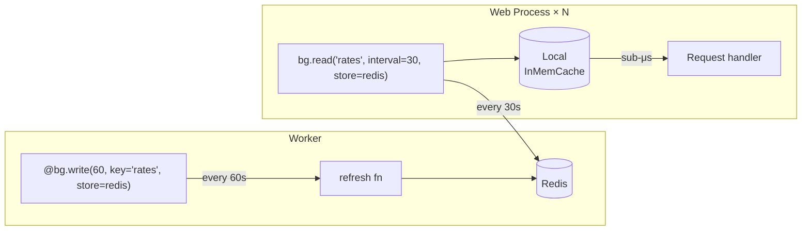

# advanced-caching

[](https://pypi.org/project/advanced-caching/)
[](https://www.python.org/downloads/)
[](https://opensource.org/licenses/MIT)

A production-ready Python caching library built around two symbols: `cache` and `bg`.

It supports **TTL**, **Stale-While-Revalidate**, and **Background Refresh** — all in a single decorator that works transparently with both `def` and `async def`. Backends are pluggable (InMemory, Redis, S3, GCS, LocalFile, ChainCache), serialization is swappable (orjson, msgpack, pickle, protobuf, or custom), and metrics can be exported to Prometheus, OpenTelemetry, or GCP Cloud Monitoring. The hot path is lock-free and hits **~6–10 M ops/s** with zero external dependencies on the default config.

```
pip install advanced-caching
```

---

## Contents

1. [Install](#install)
2. [The Two Symbols](#the-two-symbols)
3. [@cache — TTL & SWR](#cache--ttl--stale-while-revalidate)
4. [@bg — Background Refresh](#bg--background-refresh)
5. [bg.write / bg.read — Multi-Process](#bgwrite--bgread--multi-process)
6. [Storage Backends](#storage-backends)
7. [Serializers](#serializers)
8. [Metrics](#metrics)
9. [Performance](#performance)
10. [Testing](#testing)

---

## Install

```bash
pip install advanced-caching                   # core — InMemCache, orjson
pip install "advanced-caching[redis]"         # RedisCache
pip install "advanced-caching[msgpack]"       # msgpack serializer
pip install "advanced-caching[s3]"            # S3Cache
pip install "advanced-caching[gcs]"           # GCSCache
```

---

## The Two Symbols

```python
from advanced_caching import cache, bg
```

Everything the library does is exposed through these two names:

| Symbol | Pattern | Works with |
|--------|---------|-----------|
| `@cache(ttl, key=…)` | TTL — expire after N seconds | `def` and `async def` |
| `@cache(ttl, stale=N, key=…)` | Stale-While-Revalidate | `def` and `async def` |
| `@bg(interval, key=…)` | Background refresh on a schedule | `def` and `async def` |
| `@bg.write(interval, key=…)` | Write half of multi-process split | `def` and `async def` |
| `bg.read(key, interval=…)` | Read half — local mirror, never blocks | returns a callable |

---

## `@cache` — TTL & Stale-While-Revalidate

### Signature

```python
cache(
    ttl: int | float,
    *,
    key: str | Callable,       # "user:{user_id}", "item:{}", or a callable
    stale: int | float = 0,    # > 0 enables Stale-While-Revalidate
    store: ... = None,         # None → fresh InMemCache() per function
    metrics: ... = None,
)
```

### TTL cache

Cache the result for `ttl` seconds. Works with sync and async functions identically.

```python
from advanced_caching import cache

@cache(60, key="user:{user_id}")
async def get_user(user_id: int) -> dict:
    return await db.fetchrow("SELECT * FROM users WHERE id=$1", user_id)

@cache(300, key="config:{env}")
def load_config(env: str) -> dict:
    return read_yaml(f"config/{env}.yaml")

user = await get_user(42)   # miss → calls DB
user = await get_user(42)   # hit  → instant, no DB
```

### Stale-While-Revalidate (SWR)

Set `stale > 0` to add a second window after the TTL expires. During this window the stale value is returned immediately while a background refresh runs — eliminating the latency spike that happens on a hard expiry.

```
t=0 ──────────── t=ttl ─────────── t=ttl+stale ──── dead
   [ fresh: hit ]   [ stale: instant + bg refresh ]  [ miss ]
```

```python
@cache(60, stale=30, key="price:{symbol}")
async def get_price(symbol: str) -> float:
    return await exchange_api.fetch(symbol)

# t < 60s  → fresh hit, no network call
# 60s–90s  → returns last known price immediately, triggers bg refresh
# t > 90s  → entry dead, blocks caller until refresh completes
```

### Key templates

```python
# Static — fastest (~16M ops/s key resolution)
@cache(60, key="feature_flags")
async def load_flags() -> dict: ...

# Positional {} — maps to the first argument
@cache(60, key="user:{}")
async def get_user(user_id: int) -> dict: ...

# Named — resolved by parameter name
@cache(60, key="order:{user_id}:{order_id}")
async def get_order(user_id: int, order_id: int) -> dict: ...

# Callable — full control
@cache(60, key=lambda uid, role: f"user:{role}:{uid}")
async def get_user_by_role(uid: int, role: str) -> dict: ...
```

### Invalidation

```python
# Delete a specific entry (same signature as the decorated function)
await get_user.invalidate(42)      # removes "user:42"
load_config.invalidate("prod")     # removes "config:prod"

# Wipe everything in the store
get_user.clear()
```

### Custom store

```python
import redis
from advanced_caching import cache, RedisCache, ChainCache, InMemCache

r = redis.from_url("redis://localhost:6379", decode_responses=False)
redis_store = RedisCache(r, prefix="myapp:")

# Single Redis store
@cache(3600, key="catalog:{page}", store=redis_store)
async def get_catalog(page: int) -> list: ...

# Two-tier: L1 InMem (60s) + L2 Redis (1h)
tiered = ChainCache.build(InMemCache(), redis_store, ttls=[60, 3600])

@cache(3600, key="catalog:{page}", store=tiered)
async def get_catalog_tiered(page: int) -> list: ...
```

---

## `@bg` — Background Refresh

`@bg` runs the function on a fixed schedule (APScheduler) and stores the result. Every call is a cache read — the function never blocks the caller. Latency is always sub-microsecond.

### Signature

```python
bg(
    interval: int | float,     # seconds between refreshes
    *,
    key: str,                  # no template placeholders — bg is zero-argument
    ttl: int | float | None = None,   # default: interval * 2
    store: ... = None,
    metrics: ... = None,
    on_error: Callable[[Exception], None] | None = None,
    run_immediately: bool = True,     # populate cache before first request
)
```

### Usage

```python
from advanced_caching import bg

# Async function — uses asyncio scheduler
@bg(300, key="feature_flags")
async def load_flags() -> dict:
    return await remote_config.fetch()

# Sync function — uses background thread scheduler
@bg(60, key="db_stats")
def collect_stats() -> dict:
    return db.execute("SELECT count(*) FROM users").fetchone()

# Call exactly like a normal function — always instant
flags = await load_flags()
stats = collect_stats()
```

### Error handling

```python
import logging

@bg(60, key="rates", on_error=lambda e: logging.warning("refresh failed: %s", e))
async def refresh_rates() -> dict:
    return await forex_api.fetch()
# On error: stale value is kept, on_error is called, scheduler keeps running
```

### Shutdown

```python
import atexit
atexit.register(bg.shutdown)

# FastAPI lifespan:
from contextlib import asynccontextmanager
@asynccontextmanager
async def lifespan(app):
    yield
    bg.shutdown()
```

---

## `bg.write` / `bg.read` — Multi-Process

For multi-process deployments (e.g. gunicorn workers), one process writes to a shared store (Redis) and every reader process keeps a private in-memory copy synced on a schedule. Reader calls are always local — they never touch Redis in the request path.



### `bg.write`

```python
bg.write(
    interval: int | float,
    *,
    key: str,
    ttl: int | float | None = None,
    store: CacheStorage | None = None,    # shared backend, e.g. RedisCache
    metrics: MetricsCollector | None = None,
    on_error: Callable | None = None,
    run_immediately: bool = True,
)
```

- **One writer per key per process** — raises `ValueError` on duplicate registration.
- Tracks `background_refresh` success/failure in `metrics=`.

```python
import redis
from advanced_caching import bg, RedisCache, InMemoryMetrics

r = redis.from_url(REDIS_URL, decode_responses=False)
shared = RedisCache(r, prefix="shared:")
metrics = InMemoryMetrics()

@bg.write(60, key="exchange_rates", store=shared, metrics=metrics)
async def refresh_rates() -> dict:
    return await forex_api.fetch_all()
```

### `bg.read`

```python
bg.read(
    key: str,
    *,
    interval: int | float = 0,
    ttl: int | float | None = None,
    store: CacheStorage | None = None,    # None → auto-discover writer's store (same process)
    metrics: MetricsCollector | None = None,
    on_error: Callable | None = None,
    run_immediately: bool = True,
) -> Callable[[], Any]
```

- Returns a **callable** — call it to get the current value from the local mirror.
- Each `bg.read()` call creates its own **independent** private local cache.
- `store=None` within the same process → auto-discovers the writer's store.

```python
# Different process from writer — must pass store explicitly:
get_rates = bg.read("exchange_rates", interval=30, store=shared)
rates = get_rates()   # local dict lookup, never blocks on Redis

# Same process as writer — store auto-discovered:
get_rates = bg.read("exchange_rates")
```

---

## Storage Backends

| Backend | Best for | Install |
|---------|---------|---------|
| `InMemCache` | Single-process apps, highest throughput | built-in |
| `RedisCache` | Distributed / multi-process | `[redis]` |
| `ChainCache` | N-level read-through (L1 + L2 + …) | built-in |
| `HybridCache` | L1 in-memory + L2 Redis, convenience wrapper | `[redis]` |
| `LocalFileCache` | Per-host disk persistence | built-in |
| `S3Cache` | Large objects, cheap durable storage | `[s3]` |
| `GCSCache` | Large objects on Google Cloud | `[gcs]` |

### `InMemCache`

Thread-safe. Lock-free hot path (GIL guarantees `dict.get` atomicity).

```python
from advanced_caching import InMemCache
store = InMemCache()
```

### `RedisCache`

```python
import redis
from advanced_caching import RedisCache, serializers

r = redis.from_url("redis://localhost:6379", decode_responses=False)

store = RedisCache(r, prefix="app:", serializer=serializers.msgpack)
```

Connection pooling:

```python
pool = redis.ConnectionPool.from_url("redis://localhost", max_connections=20)
r = redis.Redis(connection_pool=pool, decode_responses=False)
```

### `ChainCache` — multi-level read-through

On a miss at L1, reads from L2 and backfills L1. On a hit at L1, never touches L2.

```python
from advanced_caching import ChainCache, InMemCache, RedisCache

tiered = ChainCache.build(
    InMemCache(),
    RedisCache(r, prefix="v1:"),
    ttls=[60, 3600],          # L1 TTL=60s, L2 TTL=1h
)

# Three tiers:
three_tier = ChainCache.build(l1, l2, l3, ttls=[60, 3600, 86400])
```

### `LocalFileCache`

```python
from advanced_caching import LocalFileCache, serializers
store = LocalFileCache("/var/cache/myapp", serializer=serializers.json)
```

### `S3Cache` / `GCSCache`

```python
from advanced_caching import S3Cache, GCSCache, serializers

s3  = S3Cache(bucket="myapp-cache", prefix="v1/", serializer=serializers.msgpack)
gcs = GCSCache(bucket="myapp-cache", prefix="v1/", serializer=serializers.json)
```

---

## Serializers

Serializers are only relevant for backends that write bytes externally: `RedisCache`, `LocalFileCache`, `S3Cache`, `GCSCache`. `InMemCache` stores Python objects directly — no serialization overhead.

| Serializer | Symbol | Best for |
|-----------|--------|---------|
| orjson (default) | `serializers.json` | JSON-safe dicts / lists |
| pickle | `serializers.pickle` | Any Python object, no schema |
| msgpack | `serializers.msgpack` | Compact binary, large payloads |
| protobuf | `serializers.protobuf(MyClass)` | Cross-language, enforced schema |
| custom | any object with `.dumps`/`.loads` | Anything |

```python
from advanced_caching import serializers, RedisCache

RedisCache(r, serializer=serializers.json)
RedisCache(r, serializer=serializers.pickle)
RedisCache(r, serializer=serializers.msgpack)
RedisCache(r, serializer=serializers.protobuf(MyProto))

# Custom:
class MySerializer:
    def dumps(self, v: object) -> bytes: ...
    def loads(self, b: bytes) -> object: ...

RedisCache(r, serializer=MySerializer())
```

---

## Metrics

### `InMemoryMetrics` — built-in collector

```python
from advanced_caching import InMemoryMetrics

metrics = InMemoryMetrics()

@cache(60, key="user:{uid}", metrics=metrics)
async def get_user(uid: int) -> dict: ...

@bg(300, key="flags", metrics=metrics)
async def load_flags() -> dict: ...

stats = metrics.get_stats()
# {
#   "caches": {
#     "get_user": {
#       "hits": 120, "misses": 5, "hit_rate_percent": 96.0,
#       "latency_p50_ms": 0.08, "latency_p95_ms": 0.31,
#       "latency_p99_ms": 0.85, "errors": 0
#     }
#   },
#   "background_refresh": {
#     "flags": {"success": 12, "failure": 0}
#   }
# }
```

### Exporters

```python
# Prometheus (pip install prometheus_client)
from advanced_caching.exporters import PrometheusMetrics
metrics = PrometheusMetrics(namespace="myapp", subsystem="cache")

# OpenTelemetry (pip install opentelemetry-api)
from advanced_caching.exporters import OpenTelemetryMetrics
metrics = OpenTelemetryMetrics(meter_name="myapp.cache")

# GCP Cloud Monitoring (pip install google-cloud-monitoring)
from advanced_caching.exporters import GCPCloudMonitoringMetrics
metrics = GCPCloudMonitoringMetrics(project_id="my-project")
```

### Custom collector

```python
class MyMetrics:
    def record_hit(self, cache_name, key=None, metadata=None): ...
    def record_miss(self, cache_name, key=None, metadata=None): ...
    def record_set(self, cache_name, key=None, value_size=None, metadata=None): ...
    def record_delete(self, cache_name, key=None, metadata=None): ...
    def record_latency(self, cache_name, operation=None, duration_seconds=None, metadata=None): ...
    def record_error(self, cache_name, operation=None, error_type=None, metadata=None): ...
    def record_memory_usage(self, cache_name, bytes_used=None, entry_count=None, metadata=None): ...
    def record_background_refresh(self, cache_name, success=None, duration_seconds=None, metadata=None): ...
```

### `NULL_METRICS` — zero-overhead no-op

```python
from advanced_caching.metrics import NULL_METRICS

@cache(60, key="fast:{x}", metrics=NULL_METRICS)
def fast_fn(x: int) -> int: ...
```

---

## Performance

Measured on Python 3.12, Apple M2, single thread, N=200,000 iterations.

**Storage & decorator hot paths**

| Operation | Throughput | Latency |
|-----------|-----------|---------|
| `InMemCache.get()` raw | **10.3 M ops/s** | 0.10 µs |
| `@cache` sync miss (ttl=0) | **7.3 M ops/s** | 0.14 µs |
| `bg.read()` local hit | **7.5 M ops/s** | 0.13 µs |
| `@cache` sync hit — static key | **6.0 M ops/s** | 0.17 µs |
| `@cache` async hit — static key | **4.9 M ops/s** | 0.20 µs |
| `@cache` SWR stale-serve | **2.9 M ops/s** | 0.35 µs |
| `@cache` ChainCache L1 hit | **2.9 M ops/s** | 0.35 µs |
| `@cache` sync hit — named template key | **1.7 M ops/s** | 0.59 µs |
| `@cache` sync hit + InMemoryMetrics | **1.6 M ops/s** | 0.63 µs |

**Callable key strategies**

| Key type | Throughput | Latency | Notes |
|----------|-----------|---------|-------|
| `key=lambda uid: f"u:{uid}"` | **3.9 M ops/s** | 0.26 µs | Fastest callable — no inspection |
| `key=lambda t, uid: f"{t}:{uid}"` (async) | **2.7 M ops/s** | 0.37 µs | Multi-arg async |
| `key=lambda uid: f"...{md5(uid)}"` | **1.4 M ops/s** | 0.73 µs | Hashing overhead |
| `key="user:{user_id}"` template | **1.7 M ops/s** | 0.59 µs | Signature-bound template |

**Key insights:**
- **Static key** (`"feature_flags"`) is the fastest — no key computation at all (~6 M ops/s)
- **Simple lambda** (`lambda uid: f"u:{uid}"`) is **2.3× faster** than a named template — it skips signature inspection entirely
- **Hashing in the key** (`md5`, `sha256`) adds ~0.5 µs per call — use only when inputs are unbounded strings
- **Metrics** add ~0.4 µs per call; use `NULL_METRICS` (default) on ultra-hot paths

```bash
uv run python tests/benchmark.py
BENCH_N=500000 uv run python tests/benchmark.py
```

---

## Testing

```bash
uv pip install -e ".[dev,redis,tests]"

uv run pytest -q                                       # all unit tests
uv run pytest tests/test_integration_redis.py          # Redis (requires Docker)
uv run pytest tests/test_s3_cache_integration.py       # S3/GCS (docker-compose up)
```

Runnable examples:

```bash
uv run python examples/quickstart.py
uv run python examples/writer_reader.py
uv run python examples/serializers_example.py
uv run python examples/metrics_and_exporters.py
```

📖 Full API reference, production patterns, and configuration: **[docs/guide.md](docs/guide.md)**

---

## License

MIT — see [LICENSE](LICENSE).
