# advanced-caching — Production Guide

> Python ≥ 3.10 · async-native · type-safe · pluggable backends

---

## Table of Contents

1. [Core Concepts](#1-core-concepts)
2. [`@cache` Reference](#2-cache-reference)
3. [`@bg` Reference](#3-bg-reference)
4. [Storage Backends](#4-storage-backends)
5. [Serializers](#5-serializers)
6. [Metrics & Observability](#6-metrics--observability)
7. [Key Generation](#7-key-generation)
8. [Production Patterns](#8-production-patterns)
9. [Performance Guide](#9-performance-guide)
10. [Configuration Reference](#10-configuration-reference)
11. [Examples](#11-examples)

---

## 1. Core Concepts

The library exposes **two symbols**: `cache` and `bg`.

```python
from advanced_caching import cache, bg
```

### Three Caching Strategies

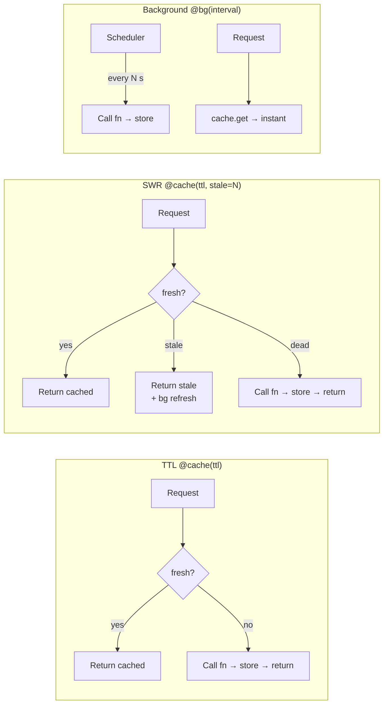

### TTL Lifecycle

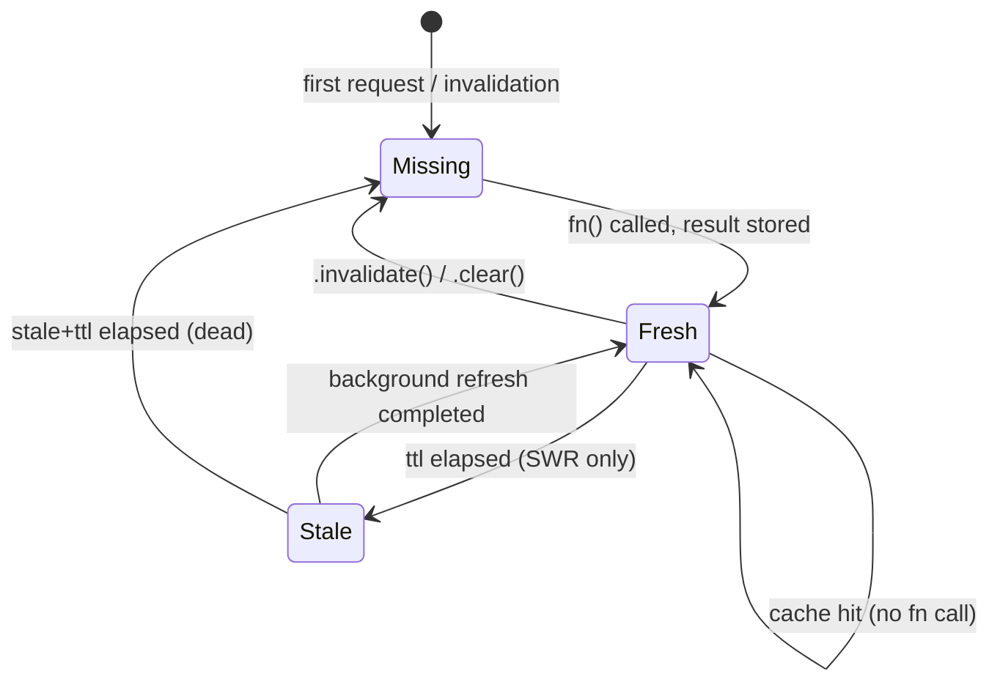

### SWR Time Windows

```mermaid
gantt
    title SWR Key Lifecycle  (ttl=60s, stale=30s)
    dateFormat  s
    axisFormat  t=%ss

    section Entry state
    Fresh — served from cache, no fn call   :active, 0, 60
    Stale — served immediately + bg refresh :        60, 30
    Dead  — blocks caller to refresh        :crit,   90, 30
```

### Background Refresh Architecture

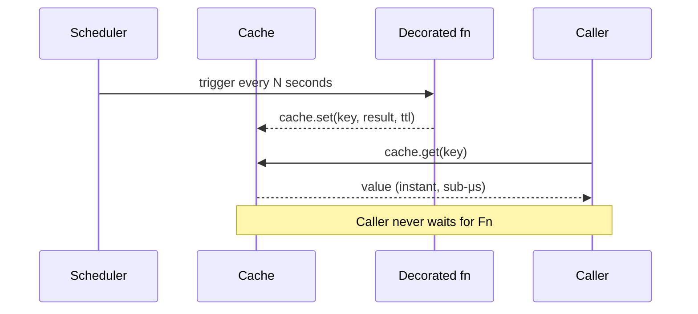

---

## 2. `@cache` Reference

### Signature

```python
cache(
    ttl: int | float,
    *,
    key: str | Callable,
    stale: int | float = 0,
    store: CacheStorage | type | Callable | None = None,
    metrics: MetricsCollector | None = None,
)
```

| Parameter | Type | Default | Notes |
|-----------|------|---------|-------|
| `ttl` | `int \| float` | required | `0` = bypass cache entirely |
| `key` | `str \| Callable` | required | Template or callable key factory |
| `stale` | `int \| float` | `0` | SWR window length (seconds). `> 0` enables SWR |
| `store` | backend | `None` → `InMemCache()` | Instance, class, or factory callable |
| `metrics` | `MetricsCollector` | `None` | Any `MetricsCollector` implementation |

### TTL Cache

```python
@cache(60, key="user:{user_id}")
async def get_user(user_id: int) -> dict:
    return await db.fetch_user(user_id)

# Works identically for sync functions:
@cache(60, key="config:{env}")
def get_config(env: str) -> dict:
    return load_from_file(env)
```

### Stale-While-Revalidate

```python
@cache(60, stale=30, key="price:{symbol}")
async def get_price(symbol: str) -> float:
    return await exchange_api.fetch(symbol)
```

- `t < 60s` → cache hit, no fn call
- `60s < t < 90s` → return stale value instantly, trigger background refresh
- `t > 90s` → entry dead, block caller, refresh synchronously

### Invalidation

Every decorated function gets two methods:

```python
# Delete a specific cache entry (same args as the decorated fn):
await get_user.invalidate(42)     # deletes "user:42"
get_config.invalidate("prod")     # deletes "config:prod"

# Wipe everything in the store:
get_user.clear()
```

### Bypass Cache

```python
@cache(0, key="debug:{x}")        # ttl=0 → always call fn, never store
def uncached(x: int) -> int: ...
```

### Custom Store Factory

Pass a callable (called once per decoration) to create a fresh store per function:

```python
from advanced_caching import cache, InMemCache

@cache(60, key="fn1:{x}", store=InMemCache)       # class → new instance
@cache(60, key="fn2:{x}", store=lambda: InMemCache())  # factory
def compute(x: int) -> int: ...
```

---

## 3. `@bg` Reference

`@bg` decouples the refresh cycle entirely from request handlers.  
Every call is a local cache read — the function never blocks the caller.

### Signature

```python
bg(
    interval: int | float,         # seconds between refreshes
    *,
    key: str,                      # cache key (no template placeholders for bg)
    ttl: int | float | None = None,
    store: CacheStorage | type | Callable | None = None,
    metrics: MetricsCollector | None = None,
    on_error: Callable[[Exception], None] | None = None,
    run_immediately: bool = True,
)
```

### Basic Usage

```python
@bg(300, key="feature_flags")
async def load_flags() -> dict:
    return await remote_config.fetch()

flags = await load_flags()   # instant after first call
```

### Sync Functions

```python
@bg(60, key="db_stats")
def collect_stats() -> dict:
    return db.execute("SELECT count(*) FROM users").fetchone()

stats = collect_stats()
```

### Error Handling

```python
import logging

@bg(60, key="rates", on_error=lambda e: logging.error("refresh failed: %s", e))
async def refresh_rates() -> dict:
    return await forex_api.fetch()
```

If `on_error` is not set, exceptions are logged at WARNING level and the stale value is kept.

### `bg.write` / `bg.read` — Multi-Process Pattern

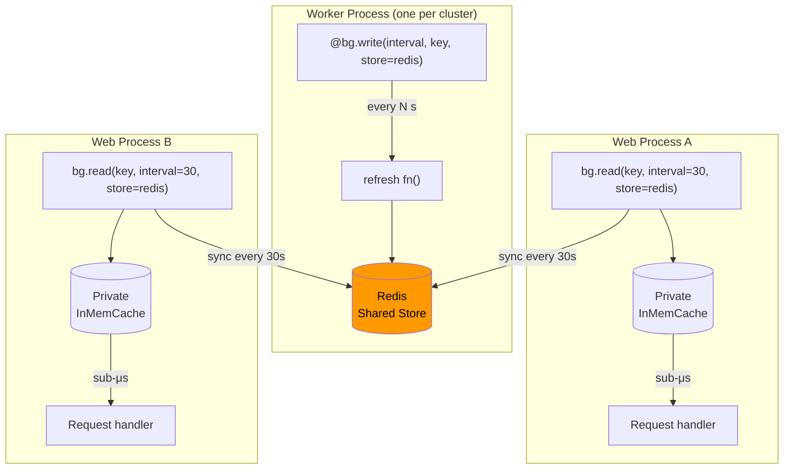

#### `bg.write`

```python
bg.write(
    interval: int | float,
    *,
    key: str,
    ttl: int | float | None = None,
    store: CacheStorage | None = None,   # shared backend (Redis)
    metrics: MetricsCollector | None = None,
    on_error: Callable | None = None,
    run_immediately: bool = True,
)
```

- **One writer per key per process** — raises `ValueError` on duplicate registration.
- `metrics=` tracks `background_refresh` success/failure + latency.

```python
@bg.write(60, key="exchange_rates", store=redis_store, metrics=metrics)
async def refresh_rates() -> dict:
    return await forex_api.fetch_all()
```

#### `bg.read`

```python
bg.read(
    key: str,
    *,
    interval: int | float = 0,
    ttl: int | float | None = None,
    store: CacheStorage | None = None,   # None → auto-discover writer's store (same process)
    metrics: MetricsCollector | None = None,
    on_error: Callable | None = None,
    run_immediately: bool = True,
) -> Callable[[], Any]
```

- Returns a **callable** — call it to get the current value from the local mirror.
- Each call to `bg.read()` creates an **independent** private local cache.
- `store=None` → auto-discovers the writer's store if `bg.write(key=…)` was called in the same process.

```python
# Same process as writer → auto-discovers redis_store
get_rates = bg.read("exchange_rates")
rates = get_rates()   # local dict lookup, never touches Redis

# Different process → must provide the store explicitly
get_rates = bg.read("exchange_rates", interval=30, store=redis_store)
```

#### `bg.shutdown`

```python
bg.shutdown(wait=True)
```

Stops all background schedulers. Register at app shutdown:

```python
import atexit
atexit.register(bg.shutdown)
```

---

## 4. Storage Backends

### Protocol

All backends implement `CacheStorage`:

```python
class CacheStorage(Protocol):
    def get(self, key: str) -> Any | None: ...
    def set(self, key: str, value: Any, ttl: int | float) -> None: ...
    def delete(self, key: str) -> None: ...
    def exists(self, key: str) -> bool: ...
    def get_entry(self, key: str) -> CacheEntry | None: ...
    def set_entry(self, key: str, entry: CacheEntry) -> None: ...
    def set_if_not_exists(self, key: str, value: Any, ttl: int | float) -> bool: ...
    def get_many(self, keys: list[str]) -> dict[str, Any]: ...
    def set_many(self, items: dict[str, Any], ttl: int | float) -> None: ...
    def clear(self) -> None: ...
```

### Backend Comparison

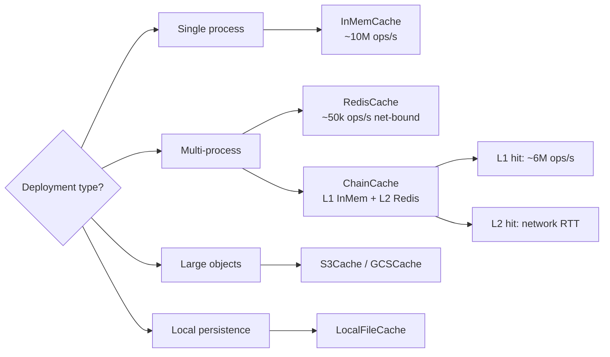

### `InMemCache`

Thread-safe, lock-free hot path (GIL atomicity on `dict.get`).

```python
from advanced_caching import InMemCache

store = InMemCache()

@cache(60, key="user:{id}", store=store)
def get_user(id: int) -> dict: ...
```

### `RedisCache`

```python
import redis
from advanced_caching import RedisCache, serializers

r = redis.from_url("redis://localhost:6379", decode_responses=False)

store = RedisCache(
    r,
    prefix="myapp:",                    # key namespace
    serializer=serializers.msgpack,    # optional — default: pickle
)

@cache(3600, key="catalog:{page}", store=store)
async def get_catalog(page: int) -> list: ...
```

Connection pooling (recommended):

```python
pool = redis.ConnectionPool.from_url("redis://localhost", max_connections=20)
r = redis.Redis(connection_pool=pool, decode_responses=False)
store = RedisCache(r, prefix="app:")
```

### `ChainCache` — N-Level Read-Through

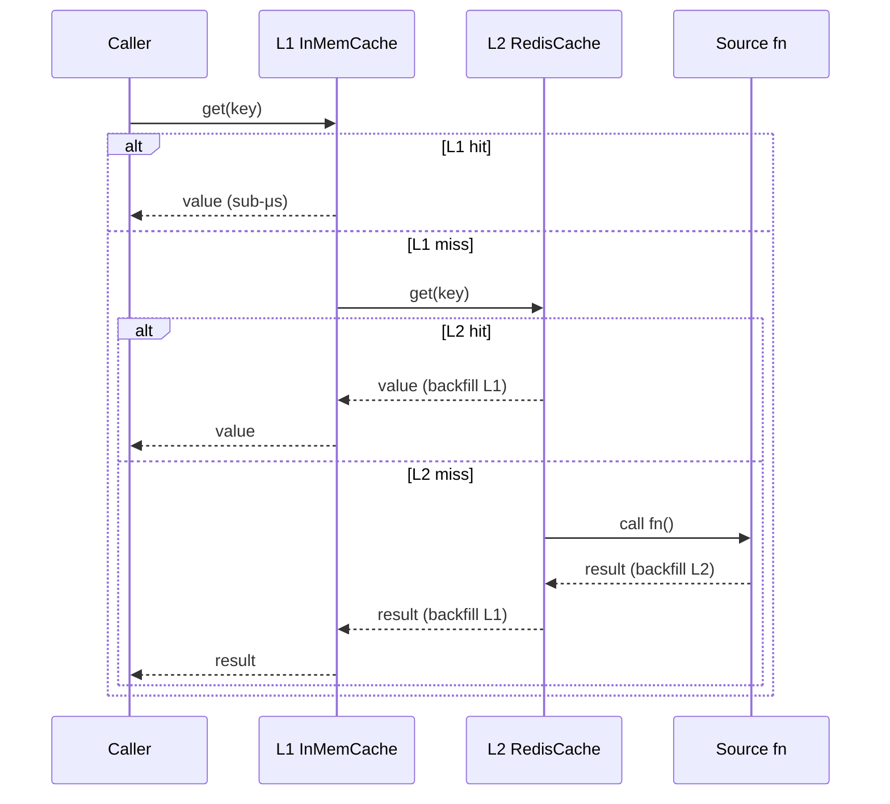

```python
from advanced_caching import ChainCache, InMemCache, RedisCache

chain = ChainCache.build(
    InMemCache(),
    RedisCache(r, prefix="v1:"),
    ttls=[60, 3600],       # L1 TTL, L2 TTL
)

@cache(3600, key="item:{id}", store=chain)
async def get_item(id: int) -> dict: ...
```

Three or more levels:

```python
three_tier = ChainCache.build(l1, l2, l3, ttls=[60, 3600, 86400])
```

### `HybridCache`

Convenience wrapper: L1 in-memory + L2 Redis with configurable TTLs.

```python
from advanced_caching import HybridCache

hybrid = HybridCache(
    l1_ttl=60,
    l1_cache=InMemCache(),
    l2_ttl=3600,
    l2_cache=RedisCache(r),
)
```

### `LocalFileCache`

Per-host disk persistence. Entries are gzip-compressed blobs.

```python
from advanced_caching import LocalFileCache, serializers

store = LocalFileCache(
    "/var/cache/myapp",
    serializer=serializers.json,   # optional
)
```

### `S3Cache` / `GCSCache`

For large objects, ML artifacts, or cheap durable caching.

```python
from advanced_caching import S3Cache, GCSCache, serializers

# AWS S3
s3 = S3Cache(bucket="myapp-cache", prefix="v1/", serializer=serializers.msgpack)

# Google Cloud Storage
gcs = GCSCache(bucket="myapp-cache", prefix="v1/", serializer=serializers.json)

@cache(86400, key="ml_features:{entity_id}", store=s3)
async def get_features(entity_id: str) -> dict: ...
```

---

## 5. Serializers

### Pipeline

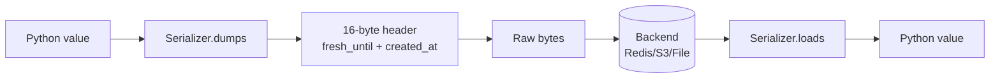

The wire format is always: `[8-byte float: fresh_until][8-byte float: created_at][serialized value]`.  
This is metadata-agnostic — any serializer works without needing a schema for the cache entry header.

### Built-in Serializers

```python
from advanced_caching import serializers

serializers.json      # orjson (default) — fastest for JSON-serializable data
serializers.pickle    # any Python object, no schema required
serializers.msgpack   # compact binary (requires pip install msgpack)
serializers.protobuf(MyProtoClass)  # Protocol Buffers (requires protobuf)
```

### Usage

```python
from advanced_caching import RedisCache, LocalFileCache, serializers

# JSON-safe data (dicts, lists, primitives)
redis_json = RedisCache(r, serializer=serializers.json)

# Arbitrary Python (dataclasses, custom objects)
redis_pickle = RedisCache(r, serializer=serializers.pickle)

# Compact binary (large payloads, best compression)
redis_msgpack = RedisCache(r, serializer=serializers.msgpack)

# Protobuf (schema-enforced, cross-language)
redis_proto = RedisCache(r, serializer=serializers.protobuf(MyProto))
```

### Custom Serializer

Implement two methods — that's all:

```python
class MySerializer:
    def dumps(self, value: object) -> bytes: ...
    def loads(self, data: bytes) -> object: ...

store = RedisCache(r, serializer=MySerializer())
```

---

## 6. Metrics & Observability

### Architecture

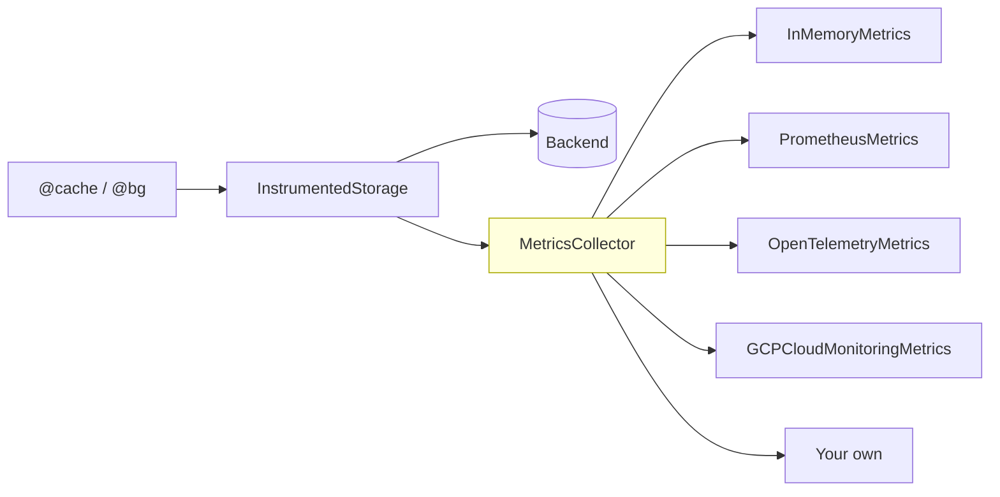

### `InMemoryMetrics`

```python
from advanced_caching import InMemoryMetrics

metrics = InMemoryMetrics()

@cache(60, key="user:{uid}", metrics=metrics)
async def get_user(uid: int) -> dict: ...

@bg(300, key="flags", metrics=metrics)
async def load_flags() -> dict: ...

stats = metrics.get_stats()
```

`get_stats()` returns a structured dict — every section is keyed by `cache_name` (the decorated function's `__name__`, or the `InstrumentedStorage` label you choose):

```python
{
  "uptime_seconds": 12.3,

  # per-function hit/miss counters
  "caches": {
    "get_user": {
      "hits": 120, "misses": 5, "sets": 5, "deletes": 0,
      "hit_rate_percent": 96.0
    }
  },

  # per-function, per-operation latency percentiles (ms)
  "latency": {
    "get_user.get": {"count": 125, "p50_ms": 0.01, "p95_ms": 0.05, "p99_ms": 0.12, "avg_ms": 0.02},
    "get_user.set": {"count":   5, "p50_ms": 0.02, "p95_ms": 0.08, "p99_ms": 0.11, "avg_ms": 0.03}
  },

  # errors keyed as "<cache_name>.<operation>": {"<ErrorType>": count}
  "errors": {},

  # optional memory snapshot (if backend reports it)
  "memory": {
    "get_user": {"bytes": 4096, "entries": 5, "mb": 0.004}
  },

  # @bg background refresh success/failure counts
  "background_refresh": {
    "flags": {"success": 12, "failure": 0}
  }
}
```

### ChainCache — per-layer metrics

Wrapping the whole chain with one `InstrumentedStorage` only gives you totals.  
Wrap **each layer individually** to get per-tier breakdown:

```python
from advanced_caching import ChainCache, InMemCache, RedisCache, S3Cache, InMemoryMetrics
from advanced_caching.storage.utils import InstrumentedStorage

m = InMemoryMetrics()

chain = ChainCache.build(
    InstrumentedStorage(InMemCache(),        m, "L1:inmem"),   # ← named per layer
    InstrumentedStorage(RedisCache(r),       m, "L2:redis"),
    InstrumentedStorage(S3Cache(s3, "bkt"), m, "L3:s3"),
    ttls=[60, 300, 3600],
)

@cache(3600, key="catalog:{page}", store=chain)
async def get_catalog(page: int) -> list: ...
```

`m.get_stats()["caches"]` then shows hit rates per tier — so you can immediately see whether your L1 is sized correctly or whether most traffic is falling through to Redis/S3:

```
Layer        hits  misses  sets  hit_rate
-----------  ----  ------  ----  --------
L1:inmem       87       5     5      94%
L2:redis        4       1     1      80%
L3:s3           1       0     0     100%
```

> **Reading the table**: a healthy setup has almost all hits at L1. If L2/L3 hit rates are high it means L1 is evicting too early — raise its TTL or increase its size.

### Custom Metrics Collector

Implement the `MetricsCollector` protocol:

```python
class MyMetrics:
    def record_hit(self, cache_name: str, key: str | None = None, metadata=None): ...
    def record_miss(self, cache_name: str, key: str | None = None, metadata=None): ...
    def record_set(self, cache_name: str, key: str | None = None, value_size: int | None = None, metadata=None): ...
    def record_delete(self, cache_name: str, key: str | None = None, metadata=None): ...
    def record_latency(self, cache_name: str, operation: str | None = None, duration_seconds: float | None = None, metadata=None): ...
    def record_error(self, cache_name: str, operation: str | None = None, error_type: str | None = None, metadata=None): ...
    def record_memory_usage(self, cache_name: str, bytes_used: int | None = None, entry_count: int | None = None, metadata=None): ...
    def record_background_refresh(self, cache_name: str, success: bool | None = None, duration_seconds: float | None = None, metadata=None): ...
```

### NULL_METRICS

Zero-overhead no-op for development or when metrics are disabled:

```python
from advanced_caching.metrics import NULL_METRICS

@cache(60, key="fast:{x}", metrics=NULL_METRICS)
def fast_fn(x: int) -> int: ...
```

### Prometheus / OpenTelemetry / GCP

```python
# Prometheus (pip install prometheus_client)
from advanced_caching.exporters import PrometheusMetrics
metrics = PrometheusMetrics(namespace="myapp", subsystem="cache")

# OpenTelemetry (pip install opentelemetry-api)
from advanced_caching.exporters import OpenTelemetryMetrics
metrics = OpenTelemetryMetrics(meter_name="myapp.cache")

# GCP Cloud Monitoring (pip install google-cloud-monitoring)
from advanced_caching.exporters import GCPCloudMonitoringMetrics
metrics = GCPCloudMonitoringMetrics(project_id="my-project")

@cache(60, key="user:{uid}", metrics=metrics)
async def get_user(uid: int) -> dict: ...
```

---

## 7. Key Generation

### Template Styles

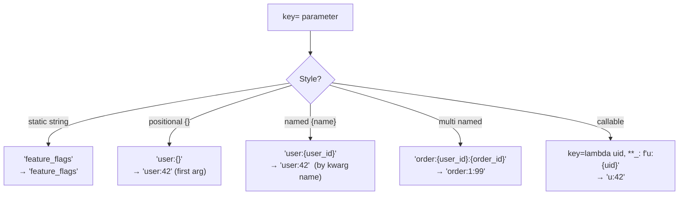

### Performance by Key Style

| Style | Example | Throughput |
|-------|---------|-----------|
| Static | `key="flags"` | ~16 M ops/s |
| Positional `{}` | `key="user:{}"` | ~7 M ops/s |
| Named `{name}` | `key="user:{user_id}"` | ~2 M ops/s |
| Multi-named | `key="order:{uid}:{oid}"` | ~2 M ops/s |
| Callable | `key=lambda u: f"u:{u}"` | varies |

### Examples

```python
# Static — zero resolution cost
@cache(60, key="feature_flags")
async def load_flags() -> dict: ...

# Positional — first argument only
@cache(60, key="user:{}")
async def get_user(user_id: int) -> dict: ...

# Named — resolved by parameter name
@cache(60, key="order:{user_id}:{order_id}")
async def get_order(user_id: int, order_id: int) -> dict: ...

# Callable — full Python, no format string limits
@cache(60, key=lambda uid, role: f"user:{role}:{uid}")
async def get_user_by_role(uid: int, role: str) -> dict: ...
```

### Callable Key Patterns

A callable receives the **exact same `*args, **kwargs`** as the decorated function. Use it when string templates aren't enough:

```python
# 1. Multi-arg tenant isolation
@cache(60, key=lambda tenant, resource_id: f"{tenant}:res:{resource_id}")
async def get_resource(tenant: str, resource_id: int) -> dict: ...

# 2. Conditional prefix (e.g. admin vs public namespace)
@cache(60, key=lambda resource_id, admin=False: ("admin" if admin else "public") + f":res:{resource_id}")
async def get_protected(resource_id: int, admin: bool = False) -> dict: ...

# 3. Hash long/arbitrary inputs (raw SQL, long query strings)
import hashlib
def _query_key(query: str) -> str:
    return "query:" + hashlib.sha256(query.encode()).hexdigest()[:16]

@cache(30, key=_query_key)
async def run_query(query: str) -> list: ...

# 4. Variadic — pick value from positional or keyword
@cache(300, key=lambda *a, **k: f"i18n:{k.get('lang', a[0] if a else 'en')}")
async def get_translations(lang: str = "en") -> dict: ...

# 5. Invalidation works identically — callable computes the key to delete
@cache(60, key=lambda uid: f"u:{uid}")
def get_user(uid: int) -> dict: ...

get_user.invalidate(42)   # deletes key "u:42"
get_user.clear()          # wipes entire store
```

> **Performance**: a simple lambda key skips signature inspection and runs at **~4 M ops/s** — roughly 2.3× faster than a named template (`~1.7 M ops/s`). Avoid calling expensive operations (network, hashing) in the key unless necessary.

---

## 8. Production Patterns

### Pattern 1 — FastAPI with Redis + Metrics

```python
from contextlib import asynccontextmanager
import redis
from fastapi import FastAPI
from advanced_caching import cache, bg, RedisCache, ChainCache, InMemCache, InMemoryMetrics

# ── Infrastructure ────────────────────────────────────────────────────────────
pool = redis.ConnectionPool.from_url("redis://localhost", max_connections=20)
r = redis.Redis(connection_pool=pool, decode_responses=False)
redis_store = RedisCache(r, prefix="app:")
tiered = ChainCache.build(InMemCache(), redis_store, ttls=[60, 3600])
metrics = InMemoryMetrics()


# ── Cache decorators ──────────────────────────────────────────────────────────
@cache(300, key="user:{user_id}", store=tiered, metrics=metrics)
async def get_user(user_id: int) -> dict:
    return await db.fetch_user(user_id)


@bg(60, key="feature_flags", store=redis_store, metrics=metrics)
async def load_flags() -> dict:
    return await remote_config.fetch()


# ── Lifespan ──────────────────────────────────────────────────────────────────
@asynccontextmanager
async def lifespan(app: FastAPI):
    yield
    bg.shutdown()


app = FastAPI(lifespan=lifespan)


@app.get("/users/{user_id}")
async def user_endpoint(user_id: int):
    return await get_user(user_id)


@app.get("/metrics")
async def metrics_endpoint():
    return metrics.get_stats()
```

### Pattern 2 — Writer / Reader (Multi-Process)

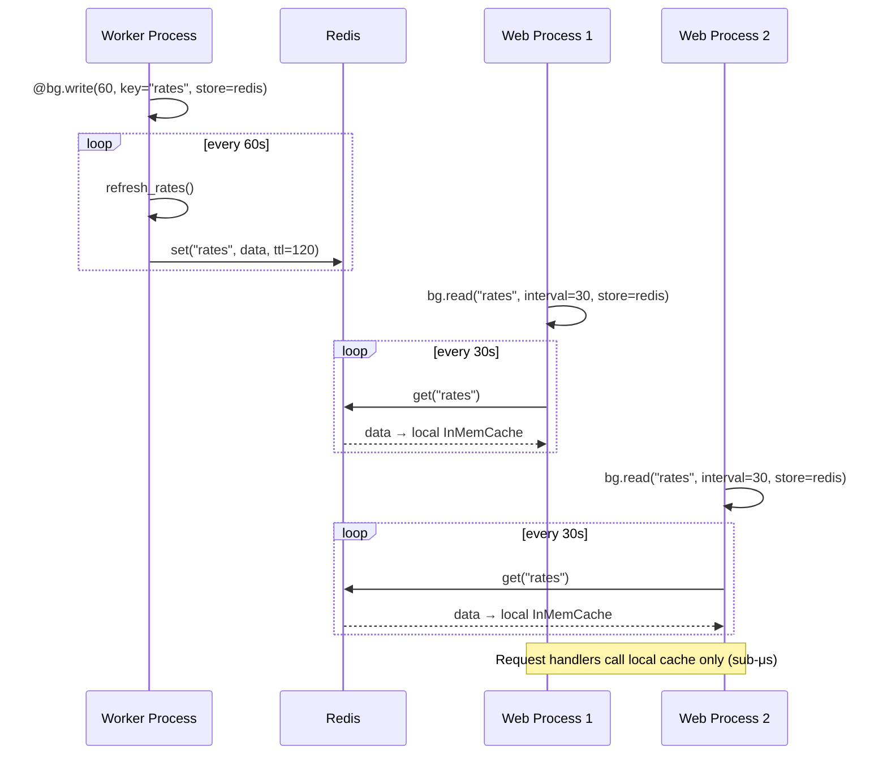

```python
# ── worker.py ─────────────────────────────────────────────────────────────────
import redis
from advanced_caching import bg, RedisCache, InMemoryMetrics

r = redis.from_url(REDIS_URL, decode_responses=False)
shared = RedisCache(r, prefix="shared:")
metrics = InMemoryMetrics()

@bg.write(60, key="exchange_rates", store=shared, metrics=metrics)
async def refresh_rates() -> dict:
    return await forex_api.fetch_all()


# ── web.py ────────────────────────────────────────────────────────────────────
import redis
from advanced_caching import bg, RedisCache

r = redis.from_url(REDIS_URL, decode_responses=False)
shared = RedisCache(r, prefix="shared:")

# Each reader has its own private local cache — no interference between readers
get_rates = bg.read("exchange_rates", interval=30, store=shared)

@app.get("/rates")
async def rates_endpoint():
    return get_rates()   # always a local dict lookup, sub-microsecond
```

### Pattern 3 — Three-Tier Cache (InMem + Redis + S3)

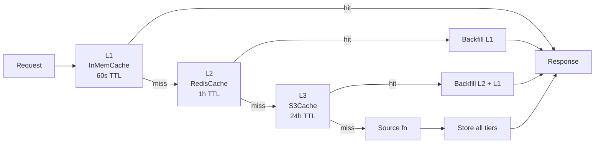

```python
from advanced_caching import cache, ChainCache, InMemCache, RedisCache, S3Cache

l1 = InMemCache()
l2 = RedisCache(redis.from_url(REDIS_URL, decode_responses=False), prefix="v1:")
l3 = S3Cache(bucket="myapp-cache", prefix="v1/")

three_tier = ChainCache.build(l1, l2, l3, ttls=[60, 3600, 86400])

@cache(86400, key="ml_features:{entity_id}", store=three_tier)
async def get_features(entity_id: str) -> dict:
    return await feature_store.fetch(entity_id)
```

### Pattern 4 — Django / Sync Application

```python
from django.http import JsonResponse
from advanced_caching import cache, InMemCache, InMemoryMetrics

metrics = InMemoryMetrics()

@cache(300, key="product:{product_id}", metrics=metrics)
def get_product(product_id: int) -> dict:
    return Product.objects.values().get(pk=product_id)


def product_view(request, product_id):
    product = get_product(product_id)
    return JsonResponse(product)
```

### Pattern 5 — Conditional Caching (TTL by result)

```python
@cache(0, key="order:{order_id}")   # ttl=0 → bypass by default
def get_order(order_id: int) -> dict:
    order = db.fetch_order(order_id)
    if order["status"] == "completed":
        # Cache completed orders indefinitely
        get_order.store.set(f"order:{order_id}", order, ttl=86400)
    return order
```

---

## 9. Performance Guide

### Throughput by Operation

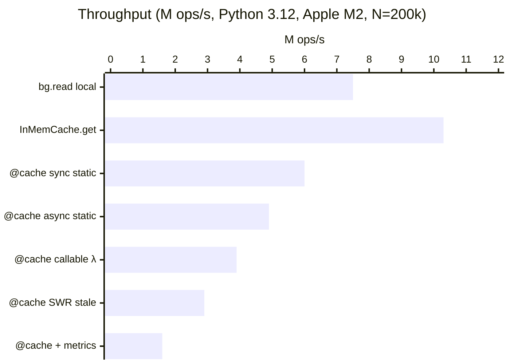

### Hot Path Breakdown (`@cache` sync hit, 100k iterations)

| Component | Time | % |
|-----------|------|---|
| `sync_wrapper` overhead | ~17 ms | 24% |
| `InMemCache.get()` dict lookup | ~10 ms | 14% |
| `_make_key_fn` (named key) | ~59 ms | 84% |
| `time.time()` syscall (×1) | ~6 ms | 9% |

> **Key insight**: Named key templates (`"user:{user_id}"`) are the single biggest overhead.  
> Use static keys where possible: `"feature_flags"` is 2.7× faster than `"flags:{name}"`.

### Optimization Checklist

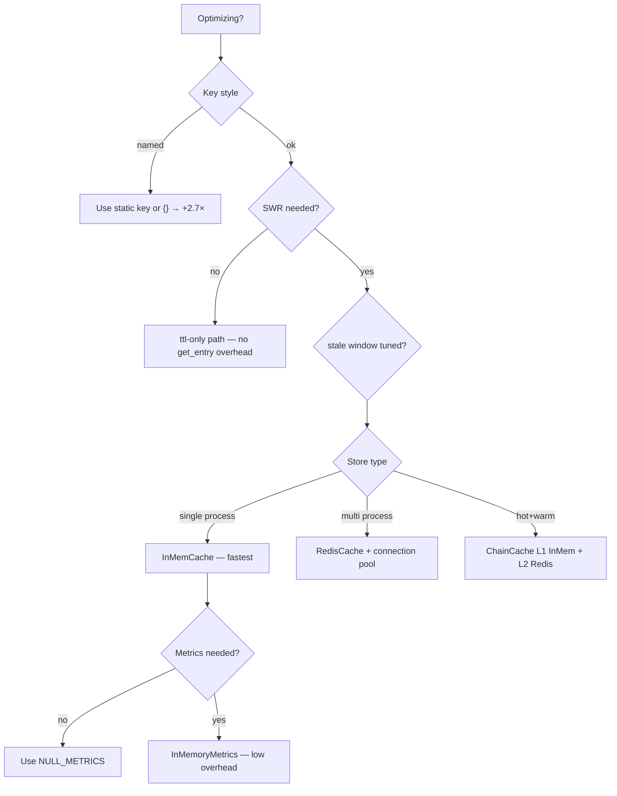

### Built-in Optimizations

- **Lock-free reads** in `InMemCache` — GIL guarantees `dict.get` atomicity; lock only on stale eviction.
- **TTL vs SWR code paths split at decoration time** — no runtime `if stale > 0` branch per call.
- **Single `time.time()` call** per cache hit (not two).
- **`__slots__`** on `InMemCache` — eliminates per-instance `__dict__` overhead.

### Profiling Your Code

```bash
# cProfile
uv run python -m cProfile -s cumulative tests/profile_decorators.py

# Scalene (line-level CPU + memory)
uv pip install scalene
uv run scalene tests/profile_decorators.py

# py-spy (sampling, no instrumentation overhead)
py-spy record -o profile.svg -- python tests/profile_decorators.py
```

### Benchmarks

```bash
uv run python tests/benchmark.py
BENCH_N=500000 uv run python tests/benchmark.py
```

---

## 10. Configuration Reference

### `@cache` Parameters

| Parameter | Type | Default | Description |
|-----------|------|---------|-------------|
| `ttl` | `int \| float` | **required** | Time-to-live in seconds. `0` = bypass. |
| `key` | `str \| Callable` | **required** | Key template or callable. |
| `stale` | `int \| float` | `0` | SWR window. `> 0` enables stale-while-revalidate. |
| `store` | backend | `None` → `InMemCache()` | Instance, class, or factory callable. |
| `metrics` | `MetricsCollector` | `None` | Any metrics collector. |

### `@bg` Parameters

| Parameter | Type | Default | Description |
|-----------|------|---------|-------------|
| `interval` | `int \| float` | **required** | Seconds between refreshes. |
| `key` | `str` | **required** | Cache key (no template placeholders). |
| `ttl` | `int \| float \| None` | `None` → `interval * 2` | TTL of stored entry. |
| `store` | backend | `None` → `InMemCache()` | Cache backend. |
| `metrics` | `MetricsCollector` | `None` | Metrics collector. |
| `on_error` | `Callable[[Exception], None]` | logs warning | Called on refresh error. |
| `run_immediately` | `bool` | `True` | Populate cache before first request. |

### `bg.write` / `bg.read` Parameters

| Parameter | `bg.write` | `bg.read` | Description |
|-----------|-----------|----------|-------------|
| `key` | **required** | **required** | Cache key. |
| `interval` | **required** | `0` | Seconds between refreshes. |
| `ttl` | `None` | `None` | Entry TTL. |
| `store` | `None` → `InMemCache()` | `None` → auto-discover | Backend. |
| `metrics` | `None` | `None` | Metrics collector. |
| `on_error` | `None` | `None` | Error callback. |
| `run_immediately` | `True` | `True` | Run at registration. |

### Storage Backends

| Backend | Constructor | Serializer | Extra dep |
|---------|-------------|-----------|-----------|
| `InMemCache` | `InMemCache()` | n/a (stores Python objects) | none |
| `RedisCache` | `RedisCache(r, prefix=, serializer=)` | optional | `[redis]` |
| `ChainCache` | `ChainCache.build(*stores, ttls=[…])` | per backend | none |
| `HybridCache` | `HybridCache(l1_ttl=, l1_cache=, l2_ttl=, l2_cache=)` | per backend | none |
| `LocalFileCache` | `LocalFileCache(dir, serializer=)` | optional | none |
| `S3Cache` | `S3Cache(bucket=, prefix=, serializer=)` | optional | `[s3]` |
| `GCSCache` | `GCSCache(bucket=, prefix=, serializer=)` | optional | `[gcs]` |

### Serializers

| Serializer | Symbol | Best for | Extra dep |
|-----------|--------|---------|-----------|
| orjson (default) | `serializers.json` | JSON-safe data | none (bundled) |
| pickle | `serializers.pickle` | Any Python object | none |
| msgpack | `serializers.msgpack` | Large payloads | `[msgpack]` |
| protobuf | `serializers.protobuf(Cls)` | Cross-language schemas | `[protobuf]` |
| custom | `MySerializer()` | Anything | — |

### Pattern Decision Tree

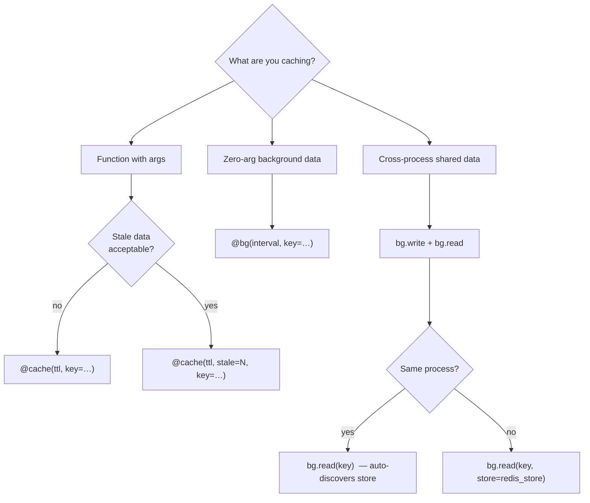

---

## 11. Examples

All runnable examples live in `examples/`. Each is self-contained and executable with:

```bash
uv run python examples/<file>.py
```

### `quickstart.py`

The fastest way to see every feature in one script.

| Section | What it shows |
|---------|--------------|
| **TTL Cache** | `@cache(ttl, key="user:{user_id}")` — miss, hit, second key |
| **SWR** | `@cache(ttl, stale=N)` — serve stale + background refresh |
| **Background refresh** | `@bg(interval, key=)` — zero-latency reads |
| **Custom store** | `store=InMemCache()` (swap for `RedisCache` in prod) |
| **Metrics** | Shared `InMemoryMetrics`, `get_stats()` hit rates |
| **Invalidation** | `.invalidate(key)` and `.clear()` |
| **Callable keys** | 5 patterns: simple λ, multi-arg, conditional, hash, varargs |

```bash
uv run python examples/quickstart.py
```

---

### `metrics_and_exporters.py`

Deep dive into metrics — how to read the output, custom collectors, and per-layer ChainCache observability.

| Section | What it shows |
|---------|--------------|
| **Shared `InMemoryMetrics`** | One collector across multiple functions; `get_stats()` table with hit rates and latency percentiles (p50/p95/p99) |
| **Custom `PrintMetrics`** | Minimal protocol implementation — logs every hit/miss to stdout |
| **`NULL_METRICS`** | Zero-overhead no-op; throughput comparison |
| **ChainCache per-layer** | Wrap each layer (L1:inmem, L2:redis, L3:s3) with `InstrumentedStorage`; watch hits/misses move up the chain as layers fill and evict |

Sample output for the ChainCache section:

```
[cold start — all layers empty]
Layer          hits  misses  sets  hit_rate
-----------   -----  ------  ----  --------
L1:inmem          0       2     2        0%
L2:redis          0       2     2        0%
L3:s3             0       2     2        0%

[L1 evicted — requests fall through to L2]
L1:inmem          2       4     4       33%
L2:redis          2       2     2       50%
L3:s3             0       2     2        0%
```

```bash
uv run python examples/metrics_and_exporters.py
```

---

### `serializers_example.py`

Benchmarks the four serializer strategies on a `LocalFileCache` backend (disk I/O — Redis/InMem would be faster, making the serializer overhead even more visible).

| Serializer | When to use |
|-----------|------------|
| `serializers.json` (orjson) | Default — fastest for JSON-safe data |
| `serializers.pickle` | Any Python object, no schema |
| `serializers.msgpack` | Large payloads — ~2× more compact than JSON |
| Custom `MySerializer` | Protobuf, Avro, Arrow, or any `dumps`/`loads` pair |

```bash
uv run python examples/serializers_example.py
```

---

### `writer_reader.py`

Demonstrates the **Single-Writer / Multi-Reader** pattern for sharing data across processes (or threads) with zero per-read latency.

```
Writer refreshes every 100 ms; readers poll from private mirrors.

[writer] refreshed → {'USD': 1.0, 'EUR': 0.92, 'GBP': 0.79, 'ts': 1710...}
tick 1:  fast_reader={'USD': 1.0, ...}  slow_reader={'USD': 1.0, ...}
tick 2:  ...
```

- `bg.write(interval, key=, store=redis_store)` — one writer, runs on a schedule
- `bg.read(key, interval=, store=redis_store)` — each reader gets a private local mirror, refreshed independently
- Readers **never block** — they return the last known value from their local copy

```bash
uv run python examples/writer_reader.py
```
